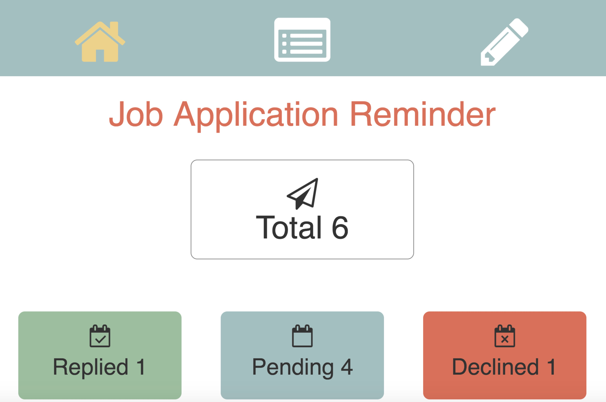
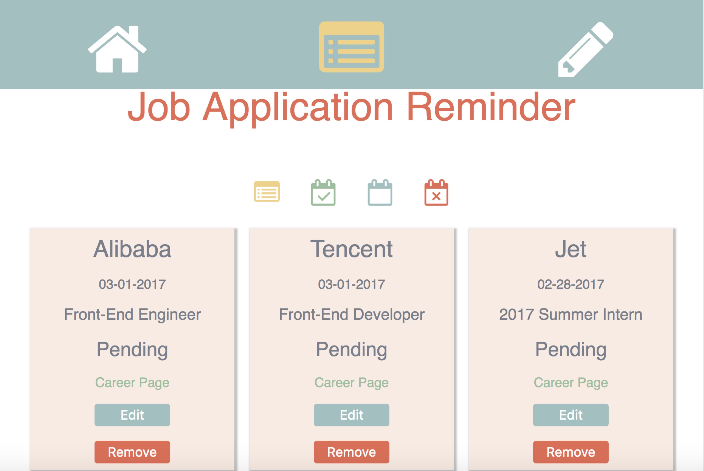
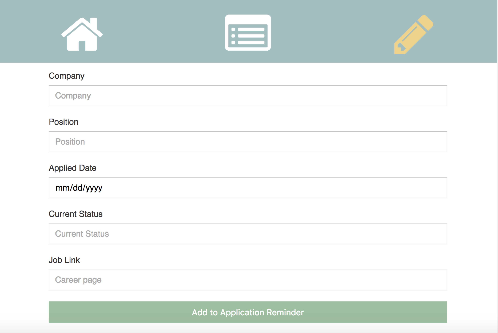
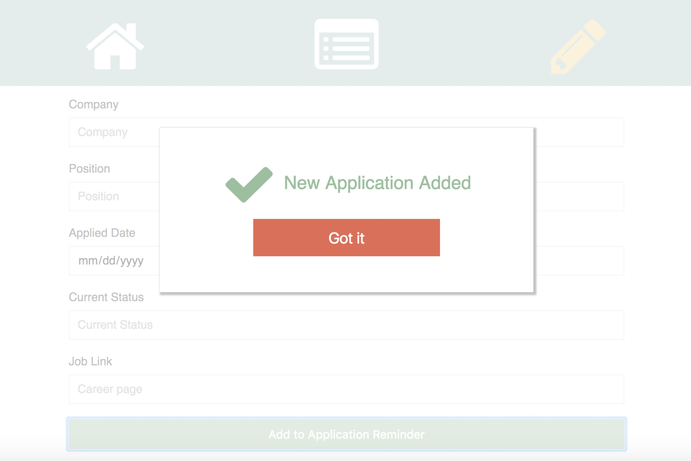

# Job-Reminder
A simple app practicing React.js

# Description

## Update
V2.0    
Now This App is refined with ```Redux```, currently based on ```React + Redux + React-Router```.

```
Components(Dump): AppRoutes, Menu, JobBoardNav
Containers(Smart): App, JobCount, JobBoard(>JobBlock), AddJobForm, PopUp
```

## Initial
V1.0    
This App is based on ```React + React-Router```.<br />
```
Components: App -> JobCount / JobBoard / AddJobForm -> JobBlock
```
An app to help me remember positions I've applied for.<br />


[Job Reminder Demo](https://robbyvan.github.io/Job-Reminder/dist/#/)

# Views

## Homepage


## Application List


## Add Form


## Confirmation

